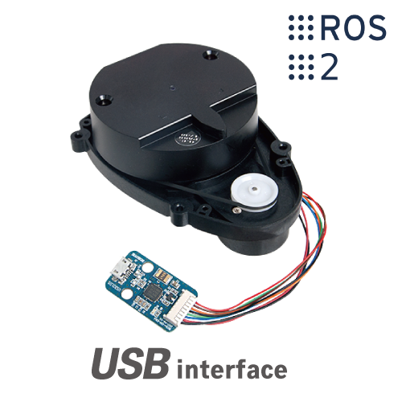
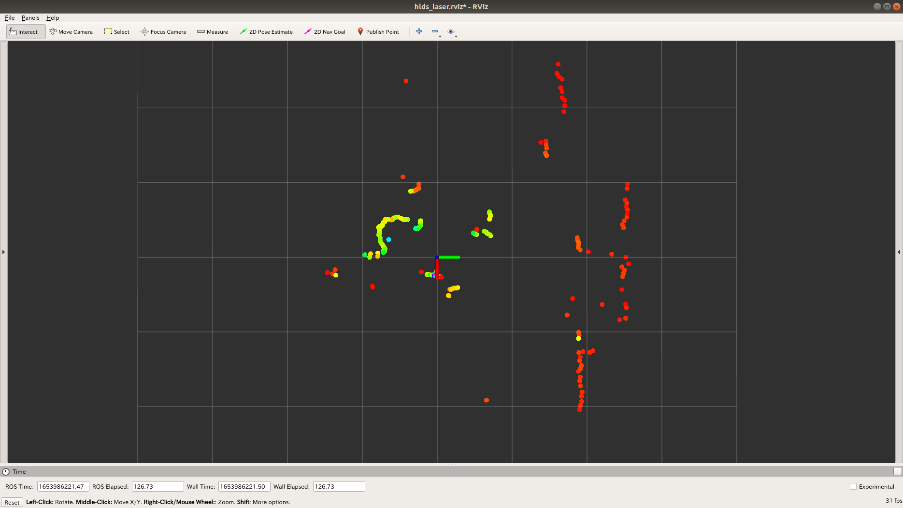

# 2D LiDAR LDS-01 ROS
2D LiDAR LDS-01用のROSパッケージ

<div align="center">
    
     
</div> 

## Setup
### ホスト環境の場合
```bash
$ cd ~/catkin_ws/src/lds_01_ros/
$ bash lds_01_setup.sh              // 必要パッケージのインストール
$ bash lds_01_rules_setup.sh        // Rulesファイルの作成
```

### Docker環境の場合
- ホスト環境
```bash 
$ cd ~/〇〇/〇〇/src/lds_01_ros/
$ bash lds_01_rules_setup.sh        // Rulesファイルの作成
```
- Docker環境
```bash 
$ cd ~/catkin_ws/src/lds_01_ros/
$ bash lds_01_setup.sh              // 必要パッケージのインストール
$ bash lds_01_rules_setup.sh        // Rulesファイルの作成
```

### How to Use
- 起動
```bash
$ roslaunch lds_01_ros hlds_laser.launch
```
- 起動とrvizでの表示
```bash
$ roslaunch lds_01_ros view_hlds_laser.launch
```

# Reference
- [hls_lfcd_lds_driver](https://wiki.ros.org/hls_lfcd_lds_driver)
- [360°の距離を計測できる2D LiDAR LDS-01を使ってみた](https://www.sato-susumu.com/entry/LDS-01)
- [udev rules for Robotis LDS-01 LIDAR](https://gist.github.com/jeremyfix/9ec54b0aed56451fc518f1440b2a82eb)